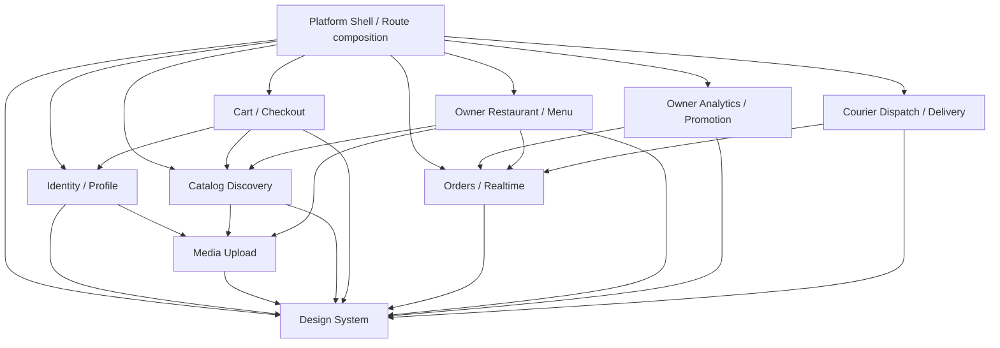

# MealDeli 模块化前端总架构

## 1. 目的与来源

本文把 [`docs/proposals`](../proposals/00-overview.md) 中的产品方案转化为可实施、可独立测试的模块架构。本文是模块边界、依赖方向、公共接口和测试隔离的唯一总入口；业务细节以同目录各模块文档为准。

本轮只编写设计文档。后续实施允许调整 `web` 与明确列出的 `api` 契约，但不得手工修改 `web/src/routeTree.gen.ts`、GraphQL 生成代码或 Prisma 生成客户端。

## 2. 架构目标

- 业务模块可通过自己的公共接口、fixtures 和 MSW handlers 单独渲染与测试。
- 路由只组合模块，不承载业务计算、GraphQL 文档或持久化逻辑。
- Apollo Cache 是服务端状态的唯一客户端副本；Jotai atoms 只保存客户端/会话状态。
- TanStack Form 管理表单生命周期，Zod 通过 Standard Schema 校验表单、持久化数据与外部输入；内部使用明确的 TypeScript domain type。
- 模块依赖单向且无环；跨模块只能从对方 `index.ts` 导入。
- UI 文案为英文，金额使用 integer cents 和 USD，订单状态只使用现有五态。

### 2.1 已安装工具基线

- `jotai@2.20.2`：跨组件客户端状态、只读 derived atom、write-only action atom 和可隔离测试 store。
- `@tanstack/react-form@1.33.5`：登录、注册、Profile、地址、Restaurant、Dish、Option builder 等表单的 values、dirty、errors、submitting 和 field array。
- `zod@4.4.3`：通过 Standard Schema 接入 TanStack Form，同时校验 URL search、localStorage hydration、runtime config 和 REST response。

表单状态不得复制到 Jotai；Jotai action atom 不负责字段级校验。Zod schema 是输入约束的唯一来源，不再维护平行的手写 validate 函数。

文档中的 `JotaiStore` 统一指 `ReturnType<typeof createStore>`（`createStore` 来自 `jotai/vanilla`），避免与 TanStack Form 内部 store 或其他通用 `Store` 类型混淆。

## 3. 模块清单与职责

| 模块 | 建议代码位置 | 独占职责 |
| --- | --- | --- |
| [Platform Shell/PWA](./01-platform-shell-pwa.md) | `web/src/app/` | bootstrap、providers、router composition、runtime config、Apollo transport、PWA |
| [Design System](./02-design-system.md) | `web/src/shared/ui/` | token、无业务 UI primitive、格式化展示组件 |
| [Identity/Profile](./03-identity-profile.md) | `web/src/modules/identity/` | session、Auth、verification、profile、角色门禁 |
| [Media Upload](./04-media-upload.md) | `web/src/modules/media/` | 图片选择、校验、上传和稳定 URL |
| [Catalog Discovery](./05-catalog-discovery.md) | `web/src/modules/catalog/` | Category/Restaurant/Dish 只读浏览与搜索 |
| [Cart/Checkout](./06-cart-checkout.md) | `web/src/modules/checkout/` | Dish 定制、Cart、本地持久化、地址和下单 |
| [Orders/Realtime](./07-orders-realtime.md) | `web/src/modules/orders/` | Order read model、列表、详情、状态机和订阅 |
| [Owner Restaurant/Menu](./08-owner-restaurant-menu.md) | `web/src/modules/owner-management/` | 多餐厅、Restaurant/Dish CRUD、option builder |
| [Owner Analytics/Promotion](./09-owner-analytics-promotion.md) | `web/src/modules/owner-insights/` | 7 天聚合、图表和 Promotion |
| [Courier Dispatch/Delivery](./10-courier-dispatch-delivery.md) | `web/src/modules/courier/` | 可接订单、接单、模拟路线和完成配送 |

`web/src/shared/` 只允许放置没有业务所有权的纯能力：`ui`、`config`、`lib`、`testing`。不得以 `shared` 为由放入 Restaurant、Order、User 等业务模型。

## 4. 依赖方向



约束：

1. `src/app` 可以导入所有模块，任何模块不得导入 `src/app` 或 route 文件。
2. Design System 不导入 Apollo、Jotai、TanStack Form、GraphQL 生成代码或业务模块。
3. Orders 不依赖 Owner/Courier；后两者把 Order read model 投影为角色界面。
4. Checkout 可使用 Catalog 公共 Dish 类型，但不得访问 Catalog 内部 cache helper。
5. 模块之间只允许 `import { ... } from "../module"` 对应的公共 barrel；禁止 `../module/internal/...`。
6. 测试可以导入模块的 `testing` 子路径，但生产代码禁止导入 fixtures/MSW handlers。

## 5. 标准模块目录

```text
src/modules/<module>/
├── api/
│   ├── operations.graphql
│   ├── fragments.graphql
│   ├── repository.ts
│   └── cache.ts
├── model/
│   ├── types.ts
│   ├── schemas.ts
│   ├── atoms.ts
│   └── selectors.ts
├── forms/
│   └── form-options.ts
├── components/
├── pages/
├── testing/
│   ├── fixtures.ts
│   ├── handlers.ts
│   └── render.tsx
├── *.spec.ts(x)
└── index.ts
```

不是每个模块都必须机械创建所有目录；没有跨组件客户端状态的模块不创建 atoms，没有表单的模块不创建 forms，没有 GraphQL 的模块不创建 api。`index.ts` 只导出其他模块确实需要的类型、组件、route factory、只读 atom 或 adapter，不导出内部 mutation helper。

## 6. 公共接口规则

每个模块文档必须列出公共出口。公共接口分为：

- **Domain type**：经过 adapter 整理、稳定于 GraphQL schema 之上的只读模型。
- **Port**：模块依赖的行为接口，例如 `OrderRepository`、`MediaUploader`。
- **UI entry**：供 route composition 使用的页面组件或 route loader。
- **Atom/selector**：只暴露最小只读 derived atom；修改能力通过职责单一的 write-only action atom 提供。
- **Testing entry**：fixture builder、MSW handler factory、provider-aware render helper。

GraphQL 生成类型只在模块 `api` 层使用，不直接作为跨模块公共类型。adapter 负责将 nullable、`__typename` 和 GraphQL scalar 转成 domain model。

## 7. 数据所有权

| 数据 | 所有者 | 存储 |
| --- | --- | --- |
| User/session/access token | Identity | 内存 Jotai atoms；User 服务端数据同步 Apollo |
| Categories/Restaurants/Dishes | Catalog | Apollo Cache |
| 当前 Cart | Checkout | Jotai `atomWithStorage` + `mealdeli.cart.v1` localStorage |
| Orders | Orders | Apollo Cache |
| 当前 Owner restaurant preference | Owner Management | Jotai `atomWithStorage` + localStorage |
| Analytics | Owner Insights | 从 Order read model 纯函数派生，不持久化 |
| Courier demo route | Courier | Jotai `atomWithStorage` + module-scoped localStorage |
| 表单 value/error/dirty/submitting | 所属表单 | TanStack Form instance；不进入 Jotai/Apollo |
| Toast/modal/menu open state | 局部组件 | React state；不进入全局 atoms |

同一份服务端实体不得同时复制到 Jotai。atoms 中若需要引用服务端数据，只保存 ID 或不可变的 Cart snapshot。TanStack Form 的 values 只在表单存活期间存在；保存成功后由 Apollo/Jotai 各自的所有者更新正式状态。

## 8. GraphQL 与 REST 组织

### 8.1 Codegen

- 使用 `@graphql-codegen/client-preset`。
- operation/fragment 与所属模块共置为 `.graphql`。
- 生成目标统一为 `web/src/gql/`，该目录只读。
- 模块用生成的 `graphql()` 和 TypedDocumentNode，不手写 operation result 类型。
- fragment 名带模块前缀，例如 `CatalogRestaurantCard`、`OrdersDetail`，避免全局冲突。

### 8.2 错误边界

- Transport error：repository 抛出结构化 `NetworkError`。
- GraphQL top-level error：Apollo link 统一记录，模块映射为用户可恢复错误。
- `{ ok, error }` 业务输出：repository 转为 discriminated union，不让 UI 重复判断 nullable 字段。
- Unauthorized：Platform/Identity 触发一次 refresh；失败后统一清理会话。
- Validation：TanStack Form 读取 Zod Standard Schema 结果并映射到字段；校验错误不作为 Toast。

### 8.3 API 调整清单

后续后端实施仅增加或修正：

- `resendVerification(input: ResendVerificationInput!): ResendVerificationOutput!`
- `availableOrders: GetOrdersOutput!`
- `takeOrder` 的 Serializable 原子语义
- `cookedOrders` 与 `orderUpdates` 的正确 PubSub payload
- `POST /uploads` 的 REST auth、5MB/type 校验和稳定公共 URL

Payment schema、Order schema、OrderStatus、UserRole 均保持不变，不产生 Prisma migration。

## 9. 共享路由组合

| Route | Composition owner | 角色行为 |
| --- | --- | --- |
| `/` | Platform | Guest landing；已登录仍可查看并进入工作区 |
| `/login`、`/signup`、`/verify-email` | Identity | Auth/verification |
| `/dashboard` | Platform | CUSTOMER → `/restaurants`；OWNER → Insights；COURIER → Courier dashboard |
| `/restaurants` | Platform | CUSTOMER → Catalog；OWNER → Owner Management；其他拒绝 |
| `/restaurants/$restaurantId` | Platform | CUSTOMER → Catalog detail；OWNER → Owner overview |
| `/restaurants/.../menu|settings|promotion` | Owner modules | OWNER only |
| `/checkout` | Checkout | CUSTOMER only |
| `/orders`、`/orders/$orderId` | Orders + role projection | 三个登录角色，按身份查询/呈现 |
| `/deliveries/$orderId` | Courier | COURIER only |
| `/profile` | Identity | 所有登录角色 |

route 文件只执行参数解析、权限声明、lazy import 和页面组合。业务 loader 由模块导出，并返回 domain result。

## 10. 测试隔离规范

### 10.1 工具链

- 已安装：Vitest、React Testing Library、Testing Library DOM、MSW GraphQL/REST handlers。
- 实施模块测试前仍需补充：`jsdom`、`@testing-library/user-event`、`@testing-library/jest-dom`；当前 `web/package.json` 尚未包含这三项。
- Jotai 测试使用 `createStore()`/`Provider`，TanStack Form 测试通过真实 `useForm` 和 Testing Library 驱动，不 mock 两个库的内部实现。
- 后端继续使用 Jest、`@nestjs/testing` 和现有 e2e 配置。
- 不引入 Playwright；跨模块行为以 route-level RTL integration test 覆盖。

### 10.2 模块测试接口

每个有 Jotai 状态的模块必须导出 test store factory，内部使用 `createStore()` 创建隔离的 vanilla Jotai store；测试不得复用默认 store。每个表单导出可注入默认值的 form options/schema factory。每个 API 模块提供：

```ts
create<Module>TestStore(initialState?): JotaiStore
create<Feature>FormOptions(defaultValues?): FormOptions
create<Module>Handlers(overrides?): HttpHandler[]
build<Entity>(overrides?): Entity
render<Module>(ui, options?): RenderResult
```

MSW handler 只 mock 该模块拥有的 operation。`render<Module>` 使用 `<Provider store={testStore}>` 注入 Jotai；订阅使用可注入的 async iterable/fake transport，不在 jsdom 中启动真实 WebSocket。

### 10.3 独立命令约定

后续 scripts 设计为：

```text
pnpm test
pnpm test:watch
pnpm exec vitest run src/modules/<module>
pnpm exec vitest run src/shared/ui
```

模块验收要求测试不依赖执行顺序、真实网络、系统时钟或现有 localStorage。时间、UUID、storage 和 transport 均可注入或在 test setup 中重置。

## 11. 实施顺序

1. Platform runtime config、Design System 和测试基建。
2. Identity/session 与 Media Upload。
3. Catalog Discovery。
4. Orders read model/realtime adapter。
5. Cart/Checkout。
6. Owner Management。
7. Owner Insights/Promotion。
8. Courier Dispatch/Delivery。
9. route composition、PWA 和跨模块回归。

该顺序只表达依赖，不要求串行开发。Design System、后端 API 修正和纯 domain model 可并行。

## 12. 总体验收

- 10 个模块都有明确公共出口、依赖、mock 和独立测试范围。
- 依赖图不存在循环，route 之外没有角色页面条件分派。
- Access token 不进入 localStorage/sessionStorage；Cart 和 demo route 使用不同 versioned key。
- GraphQL/REST 失败、会话过期、实时断线和 PWA 离线状态具有一致恢复路径。
- 所有金额从 cents 格式化；所有状态转换遵循 PENDING → COOKING → WAITING → PICKED → DELIVERED。
- 生成目录、route tree 和 Prisma client 不被手工编辑。
