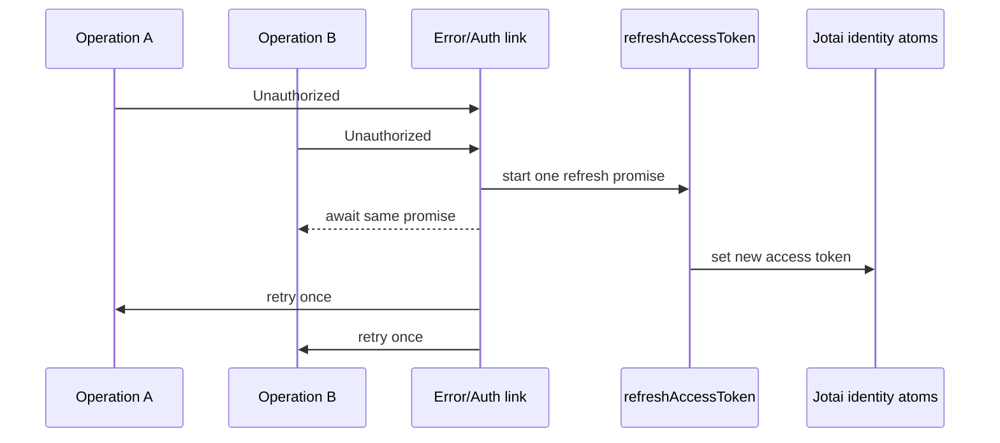

# Platform Shell 与 PWA 详细设计

## 1. 职责与非目标

Platform Shell 是应用唯一组合根，负责启动、Provider、运行时配置、Apollo transport、路由组合、全局错误、角色页面分派和 PWA 注册。

不负责：Auth 表单、业务实体、Cart、订单状态计算、餐厅 CRUD 或模块内错误文案。

## 2. 依赖与公共出口

### 2.1 依赖

- Design System：全局 layout、错误页和 loading shell。
- Identity：session bootstrap、token selector、route policy。
- 其他业务模块：仅 lazy page entry 与 route loader。

### 2.2 公共出口

```ts
export type RuntimeConfig = {
  apiHttpUrl: string;
  apiWsUrl: string;
  appOrigin: string;
};

export type AppServices = {
  apolloClient: ApolloClient;
  jotaiStore: JotaiStore;
  runtimeConfig: RuntimeConfig;
};

export function createAppServices(config: RuntimeConfig, store?: JotaiStore): AppServices;
export function AppProviders(props: { services: AppServices; children: ReactNode }): JSX.Element;
```

业务模块不得调用 `createAppServices`；测试由各模块注入自己的 repository/MSW server。

## 3. 建议目录

```text
src/app/
├── config/runtime-config.ts
├── apollo/create-apollo-client.ts
├── apollo/auth-link.ts
├── apollo/error-link.ts
├── apollo/subscription-link.ts
├── providers/app-providers.tsx
├── routing/access-policy.ts
├── routing/role-route.tsx
├── layouts/guest-layout.tsx
├── layouts/customer-layout.tsx
├── layouts/owner-layout.tsx
├── layouts/courier-layout.tsx
├── pages/landing-page.tsx
├── pwa/register.ts
└── index.ts
```

## 4. Runtime config

启动时读取并以 Zod 校验：

| 变量 | 规则 | 示例 |
| --- | --- | --- |
| `VITE_API_HTTP_URL` | absolute http/https URL | `http://localhost:3000/graphql` |
| `VITE_API_WS_URL` | absolute ws/wss URL | `ws://localhost:3000/graphql` |
| `VITE_APP_ORIGIN` | absolute origin | `http://localhost:5173` |

缺失或非法时应用不初始化 Apollo，显示 `MealDeli isn’t configured correctly.`。生产构建不得回退到 demo GraphQL URL。

## 5. Provider 顺序

```text
StrictMode
└── AppErrorBoundary
    └── JotaiProvider (services.jotaiStore)
        └── ApolloProvider
            └── RouterProvider
                ├── Route content
                └── Toaster
```

Jotai store 必须先于 Apollo 创建，以便 auth link 通过 `store.get(accessTokenAtom)` 同步读取 access token。应用与测试都显式向 `<Provider store>` 传入 store，避免落入 Jotai 默认全局 store。Router 在 session bootstrap atom 为 `checking` 时显示 App skeleton，避免私有页面闪现。

## 6. Apollo transport

### 6.1 HTTP

- `HttpLink` 使用 `VITE_API_HTTP_URL` 和 `credentials: "include"`。
- auth link 在有 access token 时通过 Jotai vanilla store 读取并添加 `Authorization: Bearer <token>`。
- 所有 operation 使用明确名称，便于日志与 MSW 匹配。

### 6.2 WebSocket

- `GraphQLWsLink` 使用 `VITE_API_WS_URL`。
- `connectionParams` 每次连接从 Identity 的只读 `accessTokenAtom` 读取最新 token。
- token 更新或 refresh 成功后重建 WS client；旧连接正常 dispose。
- exponential backoff 上限 30 秒；页面显示模块级 `Live updates are reconnecting…`，Platform 不弹重复 Toast。

### 6.3 Single-flight refresh



- 同一时刻只允许一个 refresh mutation。
- 原 operation 最多重试一次，避免无限循环。
- refresh 失败写入 `clearSessionAtom`，清空 Apollo private cache、Cart atoms 和 role preference atom，并跳转 `/login`。
- mutation 是否重试由 module repository 明确标注；已经可能在服务端成功的非幂等 mutation 先 refetch 状态，不盲目再次发送。

## 7. 路由与权限

`AccessPolicy` 接收 `sessionStatus`、`verifiedAt`、`role` 和 route metadata，返回：

```ts
type AccessDecision =
  | { kind: "allow" }
  | { kind: "redirect"; to: string; reason: "login" | "verify" | "role" };
```

规则顺序：session checking → 是否要求登录 → email verification → role → allow。`returnTo` 必须是同源的已知内部路径，登录后再次执行 role policy；无权目标落到角色默认页。

`/dashboard` 是唯一按角色选择页面的共享 route：CUSTOMER redirect `/restaurants`，OWNER lazy load Insights，COURIER lazy load Courier Dashboard。

## 8. Layout

- Guest layout：Logo、`Log in`、`Sign up` 和 landing/footer。
- Customer layout：Restaurants、Orders、Cart、Profile。
- Owner layout：桌面侧栏，移动底栏，Orders badge。
- Courier layout：Dashboard、Orders、Profile、active delivery banner。

Layout 只接收导航模型和 slot，不查询业务数据。Badge、Cart count 通过模块公共 selector 注入。

## 9. Landing page

Landing page 按 proposal 实现 Hero、唯一主 CTA、三角色注册入口、How it works 和 Footer。页面只依赖 Design System 与静态品牌资产；不调用 Catalog API。角色 CTA 分别跳转 `/signup?role=CUSTOMER|OWNER|COURIER`。

## 10. PWA 策略

- Manifest 维持 MealDeli 名称、Jade theme、Warm White background 和现有 icons。
- precache：构建产物、字体（若为本地）、Logo、PWA icons 和静态占位图。
- navigation：App Shell 可离线打开，但私有页面显示 `You’re offline. Connect to continue.`。
- NetworkOnly：`/graphql`、`/uploads`、OpenStreetMap tiles、邮箱和所有 mutation。
- 不缓存 GraphQL response、access token、profile、orders、Cart payload 或地图瓦片。
- service worker 更新准备好后提示 `A new version is ready.` + `Reload`，不在填写表单或下单中自动 reload。

## 11. 错误处理

| 错误 | 处理 |
| --- | --- |
| Runtime config invalid | 启动错误页，不创建 Apollo |
| Chunk load failed | 一次 `Reload`；仍失败显示支持信息 |
| Root render error | Error Boundary + `Reload MealDeli` |
| Offline business route | 保留 shell，显示联网要求 |
| Session expired | 清私有状态并登录跳转 |
| Role mismatch | `You don’t have access to this page.` 后跳默认页 |

## 12. 独立测试

- `parseRuntimeConfig`：合法 URL、缺失、错误协议。
- `AccessPolicy`：Guest、未验证、三角色、非法 returnTo。
- Provider smoke test：bootstrap checking 时不渲染私有页面。
- auth link：有/无 token；两个 Unauthorized 只调用一次 refresh；失败只清理一次。
- WS link：token 更新后重建，reconnect 不重复订阅。
- PWA config contract：GraphQL/uploads 不进入 runtime cache；update prompt 不自动 reload。
- Landing：三 CTA 目标、键盘顺序、唯一 H1。

测试使用 `createStore()`、Identity atoms 和 MSW refresh handler，不连接真实 API/WS/service worker。每例通过 `<Provider store={store}>` 注入，验证不同 store 之间状态不泄漏。

## 13. 验收标准

- 任何模块都不反向导入 Platform。
- 私有页面在 session/verification 未确认前不会闪现。
- Access token 只存在内存，refresh cookie 请求包含 credentials。
- 并发 Unauthorized 只产生一次 refresh，原请求最多重试一次。
- 离线时 App Shell 可打开，但任何业务读取/写入均不伪装成功。
- 当前用户的 `web` PWA 配置和品牌资产在实施时被复用，不被无理由重建。
