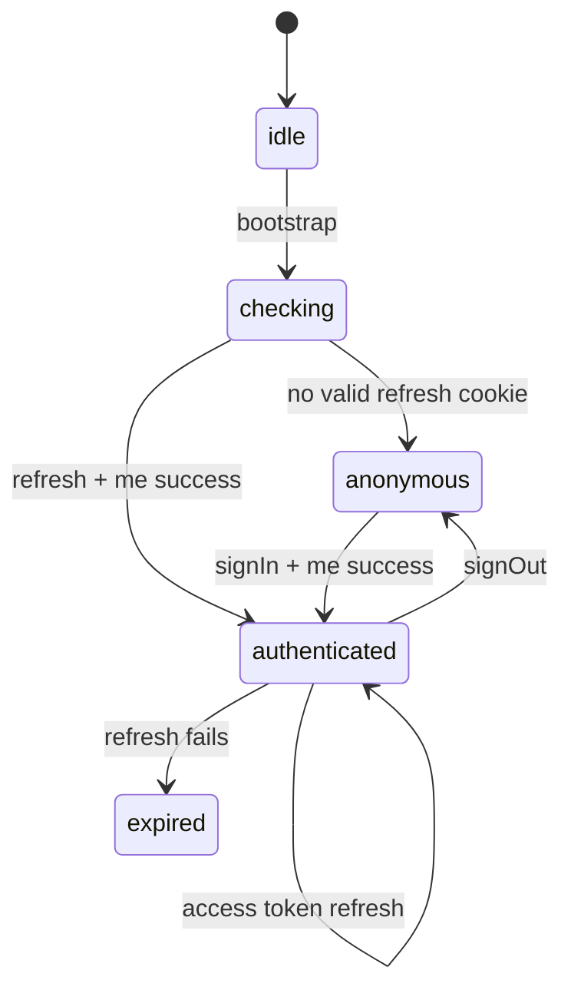

# Identity 与 Profile 详细设计

## 1. 职责与非目标

Identity 模块拥有注册、登录、邮箱验证、重发验证邮件、session bootstrap、access token、退出、Profile 和角色访问信息。

不负责：Apollo client 构造、页面全局 layout、餐厅/订单查询、Cart 持久化、上传实现。头像只调用 Media 公共 port。

## 2. 依赖与公共出口

依赖 Design System、Media Upload、Apollo transport port、Jotai、TanStack Form、Zod。

```ts
export type UserRole = "CUSTOMER" | "OWNER" | "COURIER";

export type SessionUser = {
  id: string;
  email: string;
  name: string;
  role: UserRole;
  verifiedAt: string | null;
  address: string | null;
  image: string | null;
};

export type SessionStatus =
  | "idle"
  | "checking"
  | "authenticated"
  | "anonymous"
  | "expired";

export type IdentitySnapshot = {
  status: SessionStatus;
  accessToken: string | null;
  user: SessionUser | null;
};

export const identityAtom: Atom<IdentitySnapshot>;
export const sessionUserAtom: Atom<SessionUser | null>;
export const accessTokenAtom: Atom<string | null>;
export const bootstrapSessionAtom: WritableAtom<null, [], Promise<void>>;
export const setAuthenticatedAtom: WritableAtom<
  null,
  [{ accessToken: string; user: SessionUser }],
  void
>;
export const clearSessionAtom: WritableAtom<
  null,
  [{ reason: "logout" | "expired" }],
  void
>;
export function createIdentityTestStore(initial?: Partial<IdentitySnapshot>): JotaiStore;
export const getRoleHome: (role: UserRole) => string;
```

其他模块只能导入只读 derived atoms 和 `user.id/role/address`；只有 Platform 与 Identity UI 可以写 action atoms。不得导出 refresh token。

## 3. 建议目录

```text
src/modules/identity/
├── api/identity.graphql
├── api/profile.graphql
├── api/identity-repository.ts
├── model/session-atoms.ts
├── model/session-machine.ts
├── model/schemas.ts
├── model/access-policy-input.ts
├── forms/login-form-options.ts
├── forms/signup-form-options.ts
├── forms/profile-form-options.ts
├── components/login-form.tsx
├── components/signup-form.tsx
├── components/check-email.tsx
├── components/profile-form.tsx
├── pages/login-page.tsx
├── pages/signup-page.tsx
├── pages/verify-email-page.tsx
├── pages/profile-page.tsx
├── testing/fixtures.ts
├── testing/handlers.ts
└── index.ts
```

## 4. GraphQL operations

模块拥有以下现有 operation：`signUp`、`signIn`、`signOut`、`refreshAccessToken`、`verifyEmail`、`me`、`editProfile`。

所有 operation 使用 `Identity` 前缀命名，`me` fragment 必须包含 `id email name role verifiedAt address image`。

Repository 将 `{ ok, error }` 映射为：

```ts
type CommandResult<T = undefined> =
  | { ok: true; value: T }
  | { ok: false; code: IdentityErrorCode; message: string };
```

UI 不直接解析后端自由文本来决定状态；repository 只对明确已知错误做稳定 code 映射，其余为 `UNKNOWN`。

## 5. Session atoms 与 token

- `identityAtom`、`accessTokenAtom` 和 derived atoms 不使用 `atomWithStorage`。
- access token 只存内存，不进入 localStorage、sessionStorage、URL、日志或 Apollo persisted cache。
- refresh token 只由 HttpOnly cookie 管理；前端忽略 GraphQL response 内的 `refreshToken` 字段。
- Platform 在应用启动时对 vanilla Jotai store 执行 `store.set(bootstrapSessionAtom)`；该 action 调用一次 `refreshAccessToken`，成功后查询 `me`。
- bootstrap 失败转为 anonymous，不弹错误 Toast；用户访问私有 route 时进入登录。
- 已认证期间 `me` 查询失败但 refresh 成功时允许一次重试；仍失败清 session。



应用 store 由 Platform 使用 Jotai `createStore()` 创建并注入 `<Provider store={store}>`。测试通过 `createIdentityTestStore(initial?)` 每次创建新 store；禁止使用 Jotai default store，避免 session 跨测试泄漏。

## 6. 表单实现约定

- Login、Signup、resend 和 Profile 全部使用 `useForm`；每个表单导出 `create*FormOptions(defaultValues)` 供页面与测试复用。
- `defaultValues` 使用显式 domain form type，不从 GraphQL nullable object 直接展开。
- Zod 4 schema 作为 TanStack Form Standard Schema validator：轻量字段校验在 `onBlur`，完整交叉字段校验在 `onSubmit`。
- 字段组件通过 `<form.Field>` 将 `field.state.value`、`field.state.meta.errors`、`field.handleChange`、`field.handleBlur` 绑定到 Design System controls。
- 提交按钮使用 `form.Subscribe` 读取 `canSubmit` 与 `isSubmitting`；不得另建 React/Jotai loading flag。
- API 字段错误调用 TanStack Form field error mapping；通用错误放 form-level error，不写入 session atom。

## 7. 登录与邮箱门禁

### 7.1 Sign in

1. TanStack Form 在 submit 时执行 Login Zod schema，校验 email/password。
2. `signIn` 获得 access token。
3. 立即查询 `me` 并写入 Jotai identity atoms。
4. `verifiedAt === null` 时会话仍为 authenticated，但 Platform policy 只允许：`/`、Auth 页面、`/verify-email`、resend 和 logout。
5. 已验证用户跳角色默认页；安全合法的 `returnTo` 可覆盖。

后端 `signIn` 保持当前行为，不阻止未验证账号创建 session。

### 7.2 Verification gate

未验证用户访问业务 route 时 redirect 到一个 `Check your email` Auth view，并显示：

- `Verify your email to continue.`
- 当前 email。
- `Resend email`。
- `Log out`。

验证成功后重新查询 `me`；只有 `verifiedAt` 非空才解除 gate。

## 8. 注册与角色

`SignupSchema`：name 1–100、email 合法且 ≤255、password 8–128、role 为三态。TanStack Form 的 role default value 从 query 解析；缺失/非法时显示角色选择，不默认为 CUSTOMER。

成功后不自动登录，显示 Check email。失败保留 name/email/role，清除 password。三个首页 CTA 对应固定 role。

## 9. Verify 与 resend 后端设计

### 9.1 GraphQL contract

```graphql
input ResendVerificationInput {
  email: String!
}

type ResendVerificationOutput {
  ok: Boolean!
  error: String
}

extend type Mutation {
  resendVerification(input: ResendVerificationInput!): ResendVerificationOutput!
}
```

Mutation 不要求登录，避免新注册用户没有 session 时无法恢复。无论 email 不存在、已验证或发送成功，正常响应均为 `{ ok: true }`，防止枚举账户。

### 9.2 Service algorithm

1. trim/lowercase email。
2. 查 User 和可选 EmailVerification。
3. 不存在或已验证：直接 `{ ok: true }`。
4. `EmailVerification.updatedAt` 距当前不足 60 秒：直接 `{ ok: true }`，不发邮件。
5. 生成 32-byte token，数据库只存 SHA-256 hash，过期时间 now + 1 hour。
6. upsert verification 后发送邮件。
7. 邮件服务异常记录服务端日志并返回通用 `Could not resend verification email.`；不得暴露账户状态。

不新增 column 或 migration。DTO 使用 `@IsEmail()` 和 `@MaxLength(255)`。

### 9.3 Verify page

token 缺失不发送 mutation。loading/success/invalid-or-expired/network-error 四态按 Guest proposal。无效与过期合并文案，并提供 email 输入和 resend。

## 10. Profile

Profile 使用 TanStack Form；其 Zod schema 与 API 对齐：name、email、address ≤500、image URL/null、new password 可选且 8–128。

- 图片先通过 Media 上传，成功 URL 通过 `field.handleChange(url)` 写入 TanStack Form state。
- email 变化成功后立即 refetch `me`，进入 verification gate。
- 保存其他字段后更新 Apollo User fragment 和 Jotai session user atom，避免 Header 显示旧数据。
- role 只读，不提交。
- logout 即使 mutation 网络失败也清本地 session；服务端 cookie 清理失败由过期时间兜底。

## 11. 错误与隐私

| 场景 | 行为 |
| --- | --- |
| 错误 email/password | 统一 `Incorrect email or password.` |
| duplicate signup | `An account with this email already exists.` |
| refresh reuse/expired | 清 session，显示 session expired |
| resend cooldown | 仍显示成功；前端 30 秒禁用按钮 |
| verify invalid/expired | 合并安全文案，提供 resend |
| profile email duplicate | 字段错误，不清当前 session |

不得记录 password、verification token、access/refresh token。测试 fixtures 只使用虚构域名。

## 12. 独立测试

### 12.1 前端

- Zod：三个 role、非法 query、密码边界、Profile nullable 字段。
- Jotai atoms：bootstrap success/anonymous、logout、expired、derived atoms 和 token 不持久化。
- TanStack Form：default values、Zod onBlur/onSubmit、field/server error、`isSubmitting` 防重复提交。
- Login：signIn + me，未验证 gate，三角色 redirect，returnTo 校验。
- Signup：role 预选、非法 role、重复提交、成功 check email。
- Verify：四态与重新查询 `me`。
- Resend：30 秒 UI cooldown、网络失败、未知 email 相同成功 UI。
- Profile：图片 adapter、email 改动触发 gate、Jotai/Apollo 同步。

MSW handlers 只覆盖 Identity operations；每个测试创建 fresh Apollo cache、Jotai store 和 TanStack Form instance，并用 `<Provider store={store}>` 渲染。

### 12.2 后端

- 未知/已验证/未验证 email 均不泄露账户状态。
- 60 秒内不重复发送，超过后更新 token/expiry。
- token 只以 hash 存储，旧 token 失效。
- 邮件异常返回通用错误。
- signIn 仍允许未验证账号，`me.verifiedAt` 为 null。

## 13. 验收标准

- 未验证账号有 session 但不能进入任何业务 route。
- Access token 只在内存，refresh cookie 是唯一持久会话凭据。
- 并发 refresh 由 Platform 单飞控制，Identity atoms 只接受最终 token。
- email 修改、验证成功和 session 过期能即时更新全应用访问状态。
- Identity 模块可在不加载 Catalog/Orders/Owner/Courier 的情况下独立测试。
