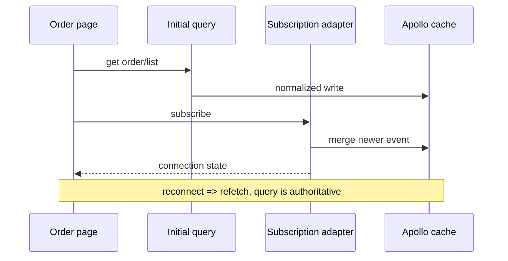

# Orders 与 Realtime 详细设计

## 1. 职责与非目标

Orders 模块拥有共享 Order read model、五态状态机、按角色查询/详情、订单时间线、Apollo cache 更新和实时订阅 adapter。角色模块可基于公共 read model 增加操作，但不得复制状态机。

不负责：Cart、Restaurant CRUD、Owner analytics、Courier 地图、拒单/取消、真实通知基础设施或多 API 实例扩展。

## 2. 依赖与公共出口

依赖 Design System、Apollo/GraphQL transport。不得依赖 Checkout、Owner 或 Courier。

```ts
export type OrderStatus = "PENDING" | "COOKING" | "WAITING" | "PICKED" | "DELIVERED";
export type OrderItem = {
  id: string;
  position: number;
  dishId: string;
  dishName: string;
  quantity: number;
  selectedOptions: readonly OrderItemOption[];
  lineTotalMinor: number;
};
export type Order = {
  id: string;
  customerId: string;
  courierId: string | null;
  restaurantId: string;
  restaurant: RestaurantSummary | null;
  status: OrderStatus;
  totalMinor: number;
  createdAt: string;
  updatedAt: string;
  items: readonly OrderItem[];
};

export interface OrderRepository {
  list(status?: OrderStatus): Promise<readonly Order[]>;
  get(id: string): Promise<Order>;
  updateStatus(id: string, status: OrderStatus): Promise<void>;
}

export interface OrderSubscriptionPort {
  orderUpdates(id: string): AsyncIterable<Order>;
  ownerPendingOrders(): AsyncIterable<Order>;
  courierReadyOrders(): AsyncIterable<Order>;
}
```

公共 UI：`OrdersPage`、`OrderDetailPage`、`OrderTimeline`、`OrderStatusBadge`。角色动作以 slots/action policy 注入。

## 3. 建议目录

```text
src/modules/orders/
├── api/orders.graphql
├── api/order-repository.ts
├── api/subscription-adapter.ts
├── api/cache-updates.ts
├── model/types.ts
├── model/status-machine.ts
├── model/role-projection.ts
├── components/order-card.tsx
├── components/order-table.tsx
├── components/order-timeline.tsx
├── pages/orders-page.tsx
├── pages/order-detail-page.tsx
├── testing/fixtures.ts
├── testing/fake-subscriptions.ts
└── index.ts
```

## 4. 状态机

```ts
const allowedTransitions = {
  PENDING: ["COOKING"],
  COOKING: ["WAITING"],
  WAITING: ["PICKED"],
  PICKED: ["DELIVERED"],
  DELIVERED: [],
} as const;
```

Orders 定义顺序/label/timeline，但权限动作由角色 policy：OWNER 只 COOKING/WAITING，COURIER 只 PICKED/DELIVERED，CUSTOMER 无 mutation。前端拒绝非法 transition；服务端必须再次验证。

## 5. GraphQL 与 adapter

模块拥有 `getOrders`、`getOrder`、`editOrder`、`orderUpdates`、`pendingOrders`、`cookedOrders`。

Fragments：`OrdersSummary`、`OrdersRestaurant`、`OrdersItem`、`OrdersDetail`。adapter：

- items 按 position 排序。
- list 按 createdAt 降序；Courier available 排序由 Courier 模块处理。
- nullable restaurant 保留 null 并显示 `Restaurant unavailable`。
- selectedOptions JSON/GraphQL entity 转稳定 read model，非法 shape 记 telemetry 并以空 options 降级，不让整页崩溃。
- timestamps 保留 ISO string；显示层格式化。

## 6. Role projection

`getOrders` 服务端已根据 current role 限制范围；前端再投影：

- Customer：Current=PENDING/COOKING/WAITING/PICKED，Past=DELIVERED。
- Owner：全部旗下餐厅，支持 restaurant/status filter。
- Courier：Active=PICKED，Completed=DELIVERED；未分配 WAITING 不属于该列表。

不存在或越权统一映射 `NOT_FOUND`，UI 使用 `Order not found`，不暴露资源归属。

## 7. Realtime 数据流



Merge 规则：

1. 只接收同 ID。
2. status rank 小于 current 时忽略。
3. 相同 rank 且 `updatedAt` 不新时忽略。
4. 新事件覆盖 status/courierId/updatedAt 和有值关联，不用 null 擦除已有 restaurant/items。
5. reconnect 成功后 refetch；查询结果可纠正本地缓存。

订阅 adapter 暴露 connection state，UI 显示 banner，不为每次 retry 发 Toast。

## 8. 后端 PubSub 修正

当前部署假设单 API 实例，保留 `graphql-subscriptions` 进程内 PubSub；文档明确多实例时事件不会跨进程。

### 8.1 cookedOrders

发布字段必须与 Subscription 名一致：

```ts
await pubSub.publish(NEW_COOKED_ORDER, {
  cookedOrders: updatedOrder,
});
```

或 resolver 显式 resolve `cookedOrder`；首选统一为 plural schema field，减少默认 resolver 差异。

### 8.2 takeOrder event

接单 transaction 返回数据库更新后的 Order，并 include restaurant owner。发布：

```ts
await pubSub.publish(NEW_ORDER_UPDATE, {
  orderUpdates: updatedOrder,
});
```

payload 必须包含 `status: PICKED`、真实 `courierId`、customerId、restaurantId、restaurant.ownerId。不得发布更新前 order 加非 schema 的 `courier` 属性。

### 8.3 Owner pending

保留 `{ pendingOrders: { ownerId, order } }` 和 resolver filter。Owner 客户端收到后插入列表，重连仍 refetch。

## 9. 页面

- `/orders`：role-aware projection 由 route composition 注入；模块复用列表组件。
- `/orders/$orderId`：共享 header、items、summary、timeline；动作 slot 由 Owner/Courier 提供。
- Customer 收到状态更新显示一次非持久 Toast；Owner pending 的持久提醒归 Owner Management；Courier available 归 Courier。

## 10. 错误与恢复

| 场景 | 行为 |
| --- | --- |
| initial query error | ErrorState + Try again |
| subscription disconnected | 保留 last-known data + reconnect banner |
| reconnect | refetch + cache reconcile |
| illegal/out-of-order event | 忽略并记录开发诊断 |
| mutation permission error | refetch order，显示动作错误 |
| not found/forbidden | 统一 not-found page |

## 11. 独立测试

- status rank/allowed transitions/role projection。
- adapter：items 排序、nullable restaurant、option snapshot。
- cache merge：新状态、重复、倒序、null association。
- Customer/Owner/Courier list projection 与空状态。
- detail loading/error/not-found、timeline 五态和 action slot。
- fake async iterable：事件、disconnect、reconnect/refetch、dispose。
- 后端 Jest：cooked payload key、takeOrder payload 完整、owner filter、非法 transition。

订阅测试使用 controllable fake transport，不启动真实 WS；clock 固定，Apollo cache 每例新建。

## 12. 验收标准

- 所有角色复用同一 Order type、状态 rank 和 timeline。
- 订阅事件不能使状态回退；重连后查询可纠错。
- Orders 可通过 fake repository/subscription 独立测试，不加载 Courier map 或 Owner chart。
- 单实例 PubSub 限制在文档与部署说明中可见。

